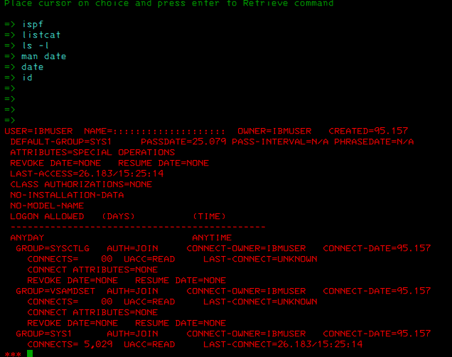
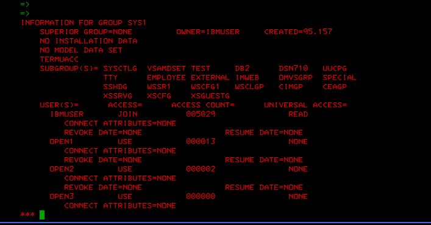
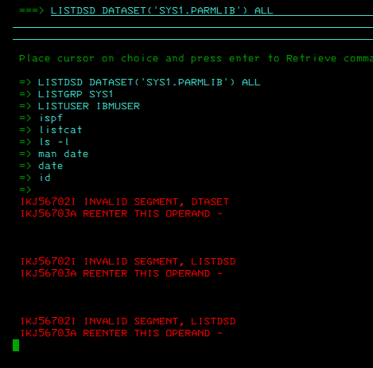

# Mainframe RACF Security Evidence Lab

## Recruiter summary

This repository contains hands-on evidence of RACF work in a z/OS ADCD / zPDT lab environment.

The objective is to demonstrate practical familiarity with:

- z/OS 3270 / TSO command usage.
- RACF user profile review.
- RACF group profile review.
- Identification of privileged RACF attributes.
- Basic privileged-access risk interpretation.
- Clear technical documentation for audit / SOC-style evidence.

> Scope note: this is a controlled training lab, not a production environment.

---

## Lab objective

Review RACF user and group information using native RACF inquiry commands and document the security meaning of the output.

Commands demonstrated:

```text
LISTUSER IBMUSER
LISTGRP SYS1
```

A third screenshot is included as troubleshooting evidence for a `LISTDSD` syntax issue encountered during dataset-profile review.

---

## Evidence 1 - RACF user profile review

Command executed:

```text
LISTUSER IBMUSER
```

Screenshot:



### What the screenshot shows

Relevant observed fields:

```text
USER=IBMUSER
OWNER=IBMUSER
DEFAULT-GROUP=SYS1
ATTRIBUTES=SPECIAL OPERATIONS
REVOKE DATE=NONE
CLASS AUTHORIZATIONS=NONE
LOGON ALLOWED ANYDAY ANYTIME
```

### Security interpretation

`IBMUSER` is an active RACF user with privileged attributes:

```text
SPECIAL
OPERATIONS
```

Meaning:

- `SPECIAL` indicates RACF security administration authority.
- `OPERATIONS` can provide broad access to installation data in many situations.
- `REVOKE DATE=NONE` indicates the account is active.
- `LOGON ALLOWED ANYDAY ANYTIME` means there is no visible logon-time restriction in this profile output.

### Recruiter-visible skill demonstrated

This evidence shows the ability to read a RACF user profile and identify privileged access indicators from native RACF output.

---

## Evidence 2 - RACF group profile review

Command executed:

```text
LISTGRP SYS1
```

Screenshot:



### What the screenshot shows

Relevant observed fields:

```text
GROUP=SYS1
SUPERIOR GROUP=NONE
OWNER=IBMUSER
```

Observed users connected to the group:

```text
IBMUSER  ACCESS=JOIN
OPEN1    ACCESS=USE
OPEN2    ACCESS=USE
OPEN3    ACCESS=USE
```

### Security interpretation

`SYS1` is a sensitive RACF group in this lab environment.

The output shows that:

- `IBMUSER` is connected to `SYS1` with `JOIN` authority.
- `OPEN1`, `OPEN2`, and `OPEN3` are connected with basic `USE` authority.
- Group membership and group authority should be periodically reviewed, especially for sensitive system groups.

### Recruiter-visible skill demonstrated

This evidence shows the ability to inspect RACF group membership and distinguish higher group authority from basic group usage.

---

## Evidence 3 - Command troubleshooting note

Command attempted:

```text
LISTDSD DATASET('SYS1.PARMLIB') ALL
```

Screenshot:



### Observed message

```text
IKJ56702I INVALID SEGMENT, DATASET
IKJ56703A REENTER THIS OPERAND
```

### Learning point

The system rejected the syntax used for the `LISTDSD` command. This is documented as troubleshooting evidence, not as a completed dataset-profile review.

Next action for a future lab:

- Validate the correct `LISTDSD` syntax for this RACF / z/OS level.
- Continue with dataset profile review for sensitive system datasets such as `SYS1.PARMLIB`.

---

## Security findings

### Finding 1 - Privileged RACF account

`IBMUSER` has both `SPECIAL` and `OPERATIONS` attributes.

Risk in a production context:

```text
A privileged account may be able to administer RACF security and access broad installation data.
```

Recommended controls:

- Minimize accounts with `SPECIAL` and `OPERATIONS`.
- Use named personal administrator IDs instead of shared IDs.
- Review privileged user reports regularly.
- Enable and review privileged activity logging where appropriate.
- Avoid using highly privileged IDs for routine daily activity.

---

### Finding 2 - Sensitive group authority

`IBMUSER` has `JOIN` authority in the `SYS1` group.

Risk in a production context:

```text
High group authority in a sensitive system group may allow administrative changes to group connections or related resources.
```

Recommended controls:

- Review sensitive group membership periodically.
- Validate business justification for high group authority.
- Apply least privilege.
- Keep evidence of approval for privileged group connections.

---

## Skills demonstrated

- 3270 / TSO navigation.
- RACF inquiry command usage.
- RACF user profile interpretation.
- RACF group profile interpretation.
- Identification of `SPECIAL` and `OPERATIONS` privileged attributes.
- Basic privileged-access review.
- Audit-style documentation.
- Troubleshooting and evidence collection.

---

## CV / LinkedIn description

### English

Hands-on RACF/zOS security lab using 3270 TSO commands. Reviewed RACF user and group profiles with `LISTUSER` and `LISTGRP`, identified `SPECIAL` and `OPERATIONS` privileged attributes, analyzed `SYS1` group membership, and documented privileged-access findings with screenshots in GitHub.

### Spanish

Laboratorio práctico de seguridad RACF/zOS usando comandos TSO en 3270. Revisión de perfiles RACF con `LISTUSER` y `LISTGRP`, identificación de atributos privilegiados `SPECIAL` y `OPERATIONS`, análisis del grupo `SYS1` y documentación de hallazgos de acceso privilegiado con evidencias visuales en GitHub.

---

## Next planned labs

- Lab 02 - DSMON Selected User Attribute Report.
- Lab 03 - RACF dataset profile review.
- Lab 04 - RACF logging and privileged activity review.
