# Evidence Walkthrough — Screenshots as Primary Evidence

The screenshots below are the central evidence for this lab. Each image has a specific security meaning.

## 01_initial_search_no_seclab_profiles.png

Initial RACF DATASET search for `IBMUSER.SECLAB*`; no entries were found.

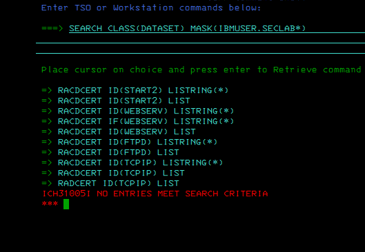

## 02_before_public_dataset_not_found.png

`PUBLIC.DATA` did not exist before the lab.

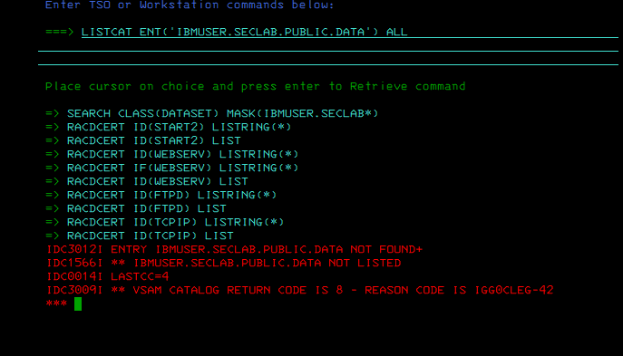

## 03_before_private_dataset_not_found.png

`PRIVATE.DATA` did not exist before the lab.

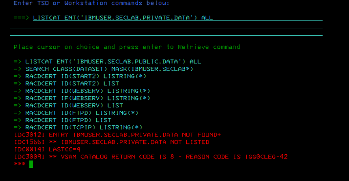

## 04_before_granted_dataset_not_found.png

`GRANTED.DATA` did not exist before the lab.

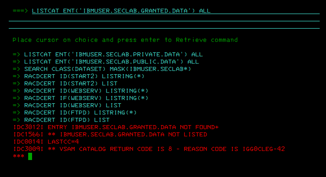

## 05_alloc_dataset_commands.png

Allocation commands for the three safe non-VSAM lab datasets.

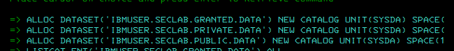

## 06_public_dataset_cataloged.png

`PUBLIC.DATA` cataloged on `SBSYS1`.

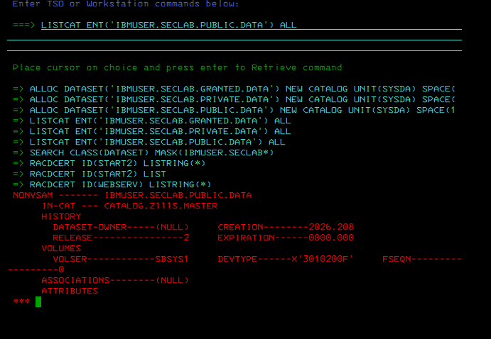

## 07_private_dataset_cataloged.png

`PRIVATE.DATA` cataloged on `SBSYS1`.

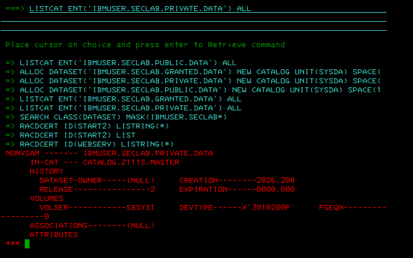

## 08_granted_dataset_cataloged.png

`GRANTED.DATA` cataloged on `SBSYS1`.

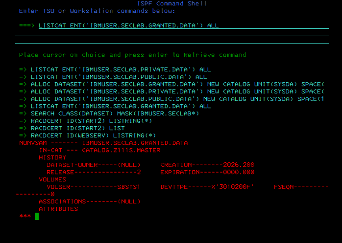

## 09_failed_addsd_double_star_generic.png

Initial `ADDSD` syntax with `**` and `GENERIC` failed; this became a useful syntax lesson.

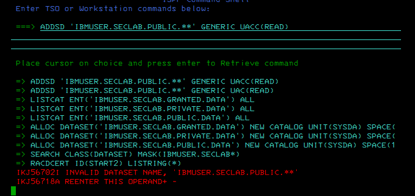

## 10_failed_listdsd_double_star_generic.png

Initial `LISTDSD` syntax against the `**` profile also failed.

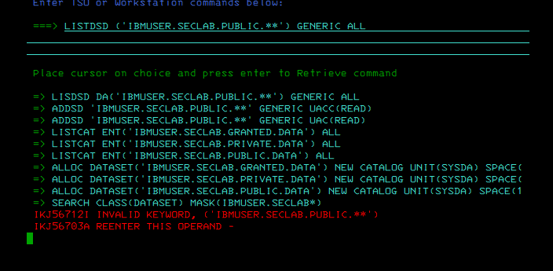

## 11_public_profile_uacc_read_top.png

Corrected public profile shows `UNIVERSAL ACCESS READ`.

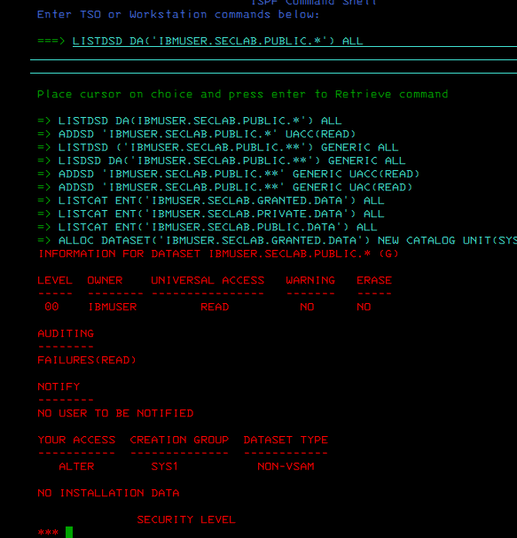

## 12_public_profile_no_access_list.png

Public profile has no standard or conditional access list entries.

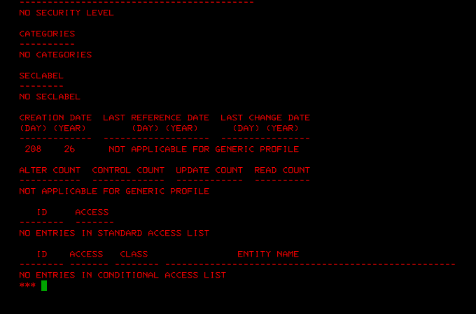

## 13_private_profile_uacc_none_top.png

Private profile shows `UNIVERSAL ACCESS NONE`.

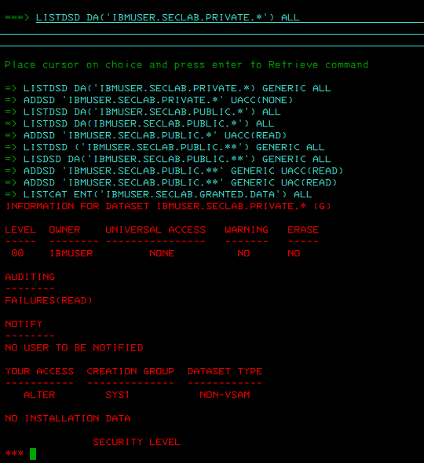

## 14_private_profile_no_access_list.png

Private profile has no standard or conditional access list entries.

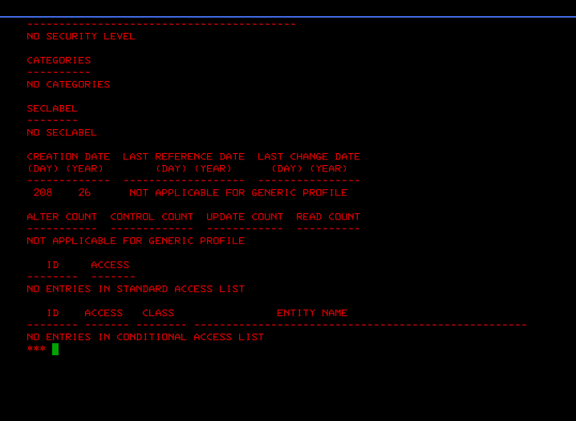

## 15_granted_profile_uacc_none_top.png

Granted profile shows `UNIVERSAL ACCESS NONE`.

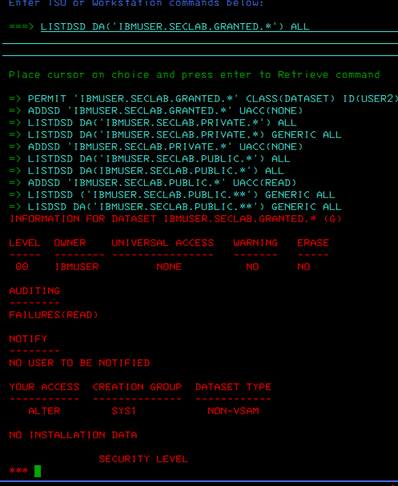

## 16_granted_user2_read_access_list.png

Granted profile includes `USER2 READ` in the standard access list.

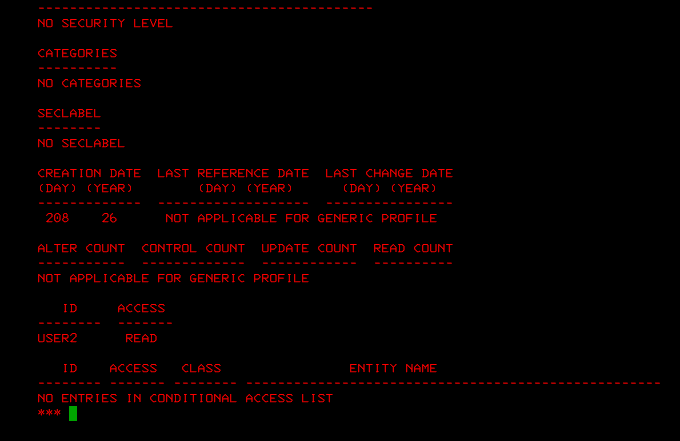

## 17_private_profile_audit_failures_read_top.png

Private profile shows `AUDITING FAILURES(READ)` after `ALTDSD`.

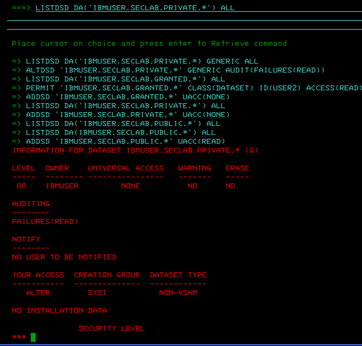

## 18_private_profile_audit_no_access_list.png

Private profile remains without access list entries after audit setting.

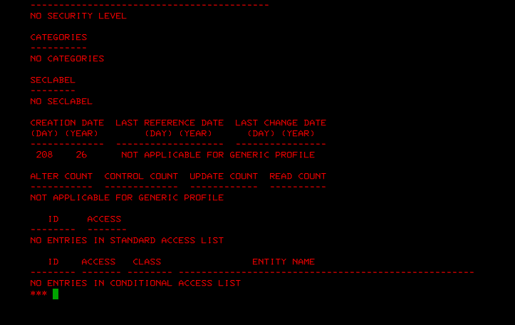

## 19_final_public_uacc_read.png

Final public profile comparison: `UACC(READ)`.

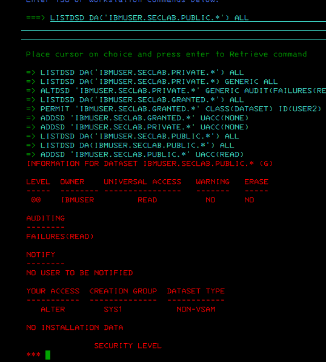

## 20_final_public_no_access_list.png

Final public profile access-list section.

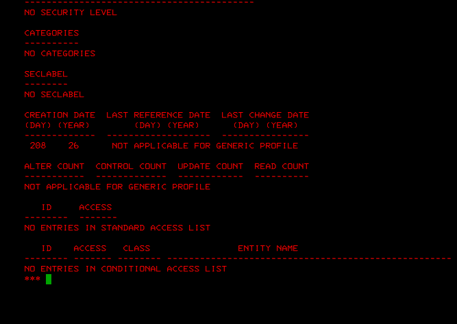

## 21_final_private_uacc_none_audit.png

Final private profile comparison: `UACC(NONE)` plus `FAILURES(READ)`.

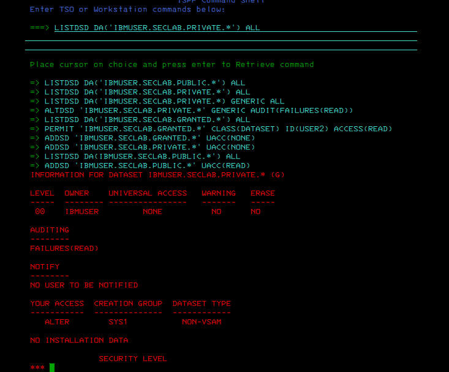

## 22_final_private_no_access_list.png

Final private profile access-list section.

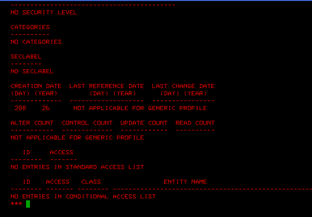

## 23_final_granted_uacc_none.png

Final granted profile comparison: `UACC(NONE)`.

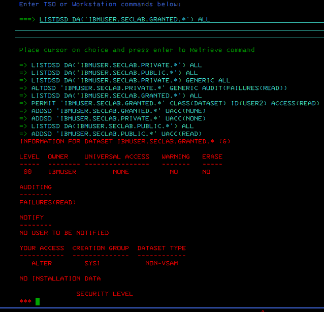

## 24_final_granted_user2_read.png

Final granted profile access-list section: `USER2 READ`.

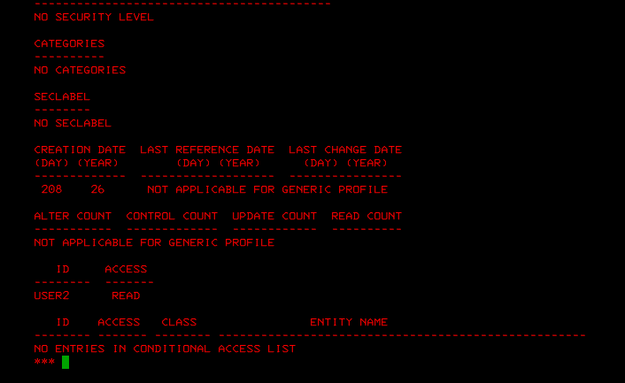

## 25_final_search_mask_no_entries_note.png

Final `SEARCH` still returned no entries; profile-specific `LISTDSD` output remains the authoritative evidence in this lab.

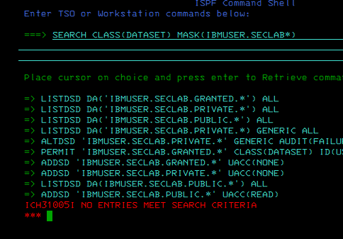
