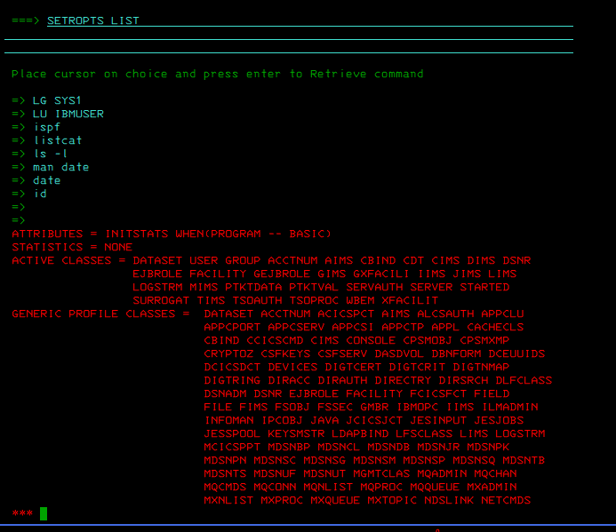
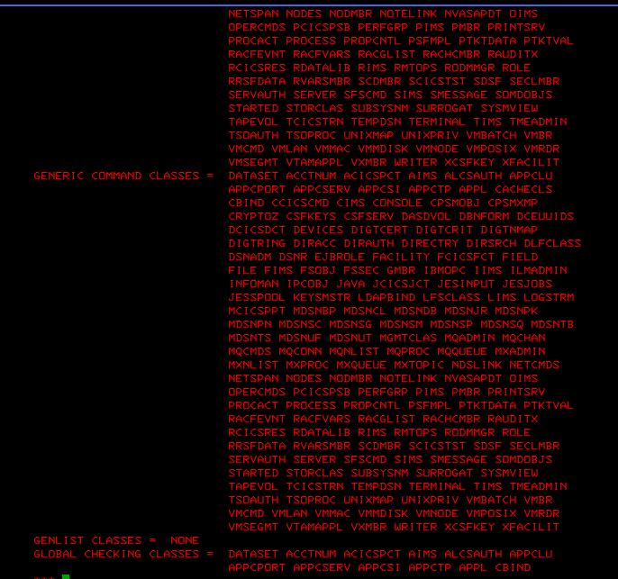
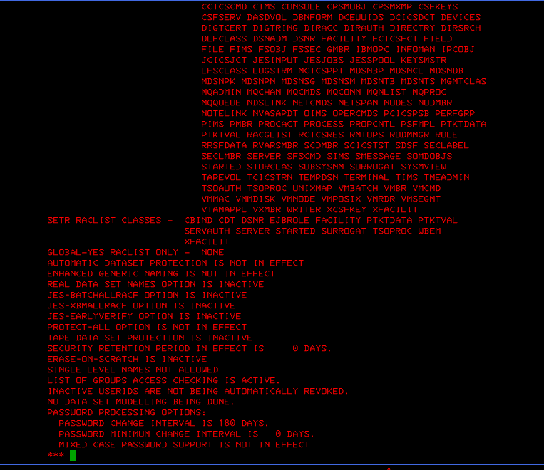
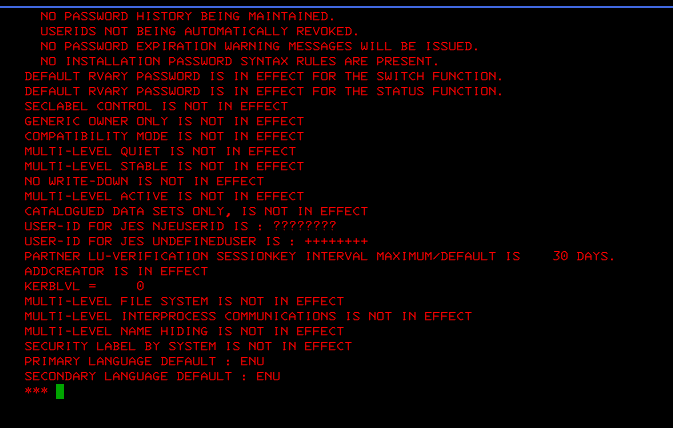

# Lab 02 - RACF Global Options Review

## Objective

This lab documents a RACF global security options review in a z/OS ADCD / zPDT lab environment.

The goal is to use `SETROPTS LIST` to inspect system-wide RACF configuration related to active classes, generic profile processing, global checking, dataset protection, user revocation and password policy indicators.

This lab is based on a practical reading of the RACF security auditing concepts covered in *IBM Mainframe Security: Beyond the Basics*, especially the use of `SETROPTS LIST` to review global RACF auditing and security-related options.

## Environment

- Platform: z/OS ADCD / zPDT lab
- Security product: IBM RACF
- Interface: TSO / ISPF 3270
- Command used: `SETROPTS LIST`

---

## 1. SETROPTS LIST - Active RACF classes

Command executed:

```text
SETROPTS LIST
```

Screenshot:



### Observations

The output shows RACF global options, including active RACF classes such as:

```text
DATASET
USER
GROUP
FACILITY
JESJOBS
STARTED
SURROGAT
OPERCMDS
```

### Security interpretation

RACF protects more than datasets. It can also protect users, groups, started tasks, JES resources, operator commands, FACILITY class resources and other z/OS components.

This demonstrates that RACF is a central security control point in z/OS.

---

## 2. Generic and global checking classes

Screenshot:



### Observations

The output shows sections related to:

```text
GENERIC COMMAND CLASSES
GENLIST CLASSES
GLOBAL CHECKING CLASSES
```

### Security interpretation

Generic profiles allow RACF to protect multiple resources using pattern-based rules such as:

```text
SYS1.**
PROD.**
PAYROLL.**
```

Global checking is relevant because it can affect how RACF performs access checking for selected classes.

---

## 3. Dataset protection, retention and password policy indicators

Screenshot:



### Observations

The captured output shows:

```text
PROTECT-ALL OPTION IS NOT IN EFFECT
SECURITY RETENTION PERIOD IN EFFECT IS 0 DAYS
ERASE-ON-SCRATCH IS INACTIVE
LIST OF GROUPS ACCESS CHECKING IS ACTIVE
INACTIVE USERIDS ARE NOT BEING AUTOMATICALLY REVOKED
PASSWORD CHANGE INTERVAL IS 180 DAYS
MIXED CASE PASSWORD SUPPORT IS NOT IN EFFECT
```

### Security interpretation

`PROTECT-ALL` is not active in this lab environment. In production, this setting should be reviewed because resources not explicitly protected may not receive RACF protection checks.

The security retention period is shown as `0 DAYS`. In production, security log retention should be formally defined to support investigations, audit requests and historical RACF activity review.

The output also confirms that list-of-groups access checking is active, which is relevant when RACF evaluates access through a user's connected groups.

---

## 4. Password history and user revocation settings

Screenshot:



### Observations

The captured output shows:

```text
NO PASSWORD HISTORY BEING MAINTAINED
USERIDS NOT BEING AUTOMATICALLY REVOKED
NO PASSWORD EXPIRATION WARNING MESSAGES WILL BE ISSUED
NO INSTALLATION PASSWORD SYNTAX RULES ARE PRESENT
SECLABEL CONTROL IS NOT IN EFFECT
ADDCREATOR IS IN EFFECT
```

### Security interpretation

Password history is not being maintained in this lab environment. In production, password reuse controls should be reviewed according to organizational password policy.

User IDs are not being automatically revoked. In production, this should be compensated by periodic access reviews or an identity governance process.

---

## Security observations

### Observation 1 - PROTECTALL not active

The output shows that `PROTECT-ALL` is not in effect.

Security relevance:

```text
In production, unprotected resources may not be subject to RACF protection checks.
```

### Observation 2 - Security retention period is 0 days

The output shows:

```text
SECURITY RETENTION PERIOD IN EFFECT IS 0 DAYS
```

Security relevance:

```text
Security log retention should be formally defined to support investigations and audit requirements.
```

### Observation 3 - Inactive users are not automatically revoked

The output shows that inactive user IDs are not automatically revoked.

Security relevance:

```text
Production environments should have compensating controls such as periodic access reviews or identity governance processes.
```

### Observation 4 - Password history is not maintained

The output shows that no password history is being maintained.

Security relevance:

```text
Password reuse controls should be reviewed according to the organization's password policy.
```

### Observation 5 - List-of-groups access checking is active

The output confirms that list-of-groups access checking is active.

Security relevance:

```text
This supports RACF access decisions based on a user's connected groups.
```

---

## Important note about LOGOPTIONS

The captured pages did not show a complete `LOGOPTIONS` section.

For this reason, this lab does not claim that no `LOGOPTIONS(NEVER(...))` setting exists. A complete production review should include all `SETROPTS LIST` pages and explicitly verify class-level logging settings.

---

## Professional value

This lab demonstrates hands-on ability to:

- Execute RACF global inquiry commands.
- Review RACF system-wide options.
- Identify active RACF classes.
- Interpret generic profile processing.
- Review dataset protection indicators.
- Review password policy indicators.
- Translate RACF output into audit-style observations.
- Document mainframe security evidence with 3270 screenshots.

## Conclusion

This lab provides visual evidence of RACF global security option review using `SETROPTS LIST`.

It complements Lab 01, which focused on RACF user and group review, by adding system-wide RACF configuration analysis.
