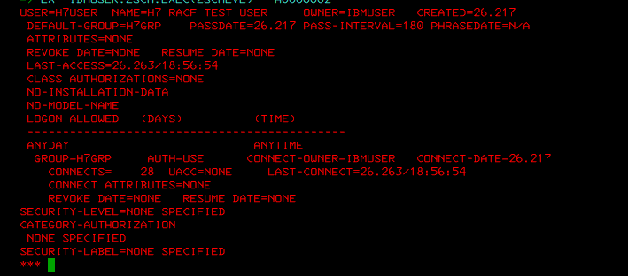
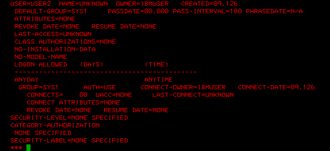
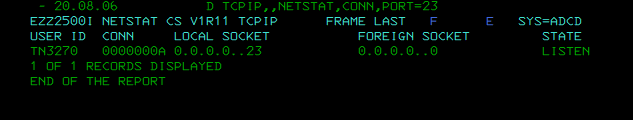
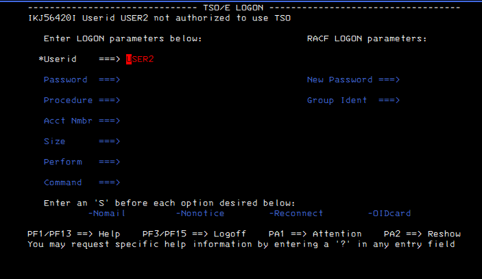
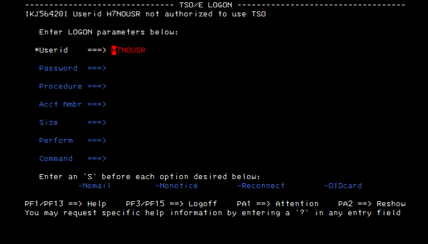
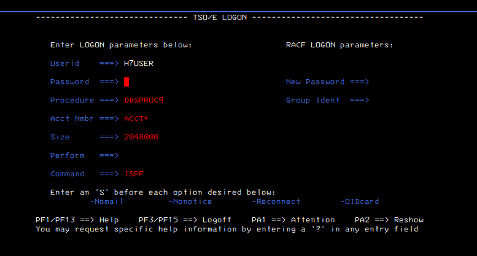
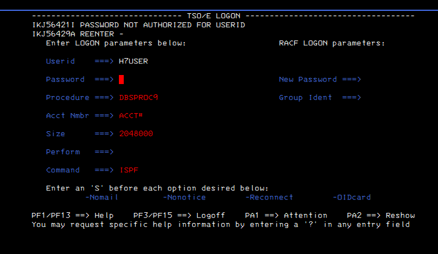
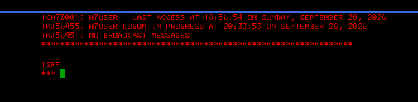

# Guided Evidence — TN3270 → TSO → RACF Authentication Boundary

[← Lab](../README.md) · [Security School](https://github.com/P-dot/P-dot/blob/main/docs/COURSES.md) · [Cross-Domain Relationships](https://github.com/P-dot/P-dot/blob/main/docs/RELATIONSHIPS.md)

This lab is a bridge between the **Communications Server** and **RACF/SAF** schools. It separates three questions that are often confused:

1. Is a TN3270 service reachable?
2. Does the submitted identity exist and have the required TSO capability?
3. Does authentication succeed?

## Trust-boundary model

    3270 client
        |
    TCP connection
        |
    TN3270 listener
        |
    TSO/E logon processing
        |
    identity / TSO eligibility
        |
    RACF credential validation
        |
    authorized session

A listening port proves only the first network/runtime portion of this chain. It does not prove that a user can authenticate or use TSO.

### Evidence 01–03 — establish identity baselines

**Observe:** RACF LISTUSER evidence distinguishes H7USER, existing USER2 and the nonexistent H7NOUSR identity.

**Interpret:** these three identities create controlled test cases. The experiment can now distinguish **defined + usable path**, **defined but not TSO-authorized path**, and **identity absent** instead of treating every failed logon as a password problem.

### Evidence 04 — prove the network service exists

**Observe:** NETSTAT reports TN3270 listening on TCP port 23.

**Interpret:** Communications Server has exposed a reachable TN3270 service endpoint at runtime.

**Security boundary:** LISTEN is not AUTHENTICATED. Network exposure and identity authorization are different control layers.

### Evidence 05 — existing RACF identity, insufficient TSO path

**Observe:** USER2 receives IKJ56420I: the userid is not authorized to use TSO.

**Interpret:** existence in RACF is not equivalent to authorization for every z/OS service. TSO logon has its own eligibility/configuration requirements.

### Evidence 06 — nonexistent identity

**Observe:** H7NOUSR also fails before reaching a usable session.

**Interpret:** the visible TSO response should be interpreted together with the RACF baseline from Evidence 03. The experiment knows this identity does not exist because LISTUSER established that fact independently.

### Evidence 07 — reach credential validation

**Observe:** H7USER reaches the password-entry state with a TSO procedure and command context.

**Interpret:** the path has progressed beyond simple TCP reachability and beyond the earlier TSO-eligibility failures. Credential validation is now the active boundary.

### Evidence 08 — controlled authentication failure

**Observe:** one intentionally incorrect credential attempt produces IKJ56421I and a re-entry prompt.

**Interpret:** the defined, TSO-capable identity can still be denied by authentication. This cleanly separates **authorization to attempt TSO use** from **successful credential verification**.

**Safety:** the evidence demonstrates the state transition without publishing a valid password.

### Evidence 09 — successful authorized session

**Observe:** the later session reports H7USER logon in progress and reaches ISPF. Sample/default credential material visible in the original environment has been removed.

**Interpret:** the complete path is now demonstrated:

    listener exists
          |
    TSO logon reached
          |
    defined + eligible identity
          |
    credentials accepted
          |
    interactive session

## What the comparison teaches

| Test case | RACF identity | TSO path | Credential result | Outcome |
|---|---|---|---|---|
| H7NOUSR | absent | cannot establish usable path | not the demonstrated boundary | rejected |
| USER2 | present | not authorized for TSO | not the demonstrated boundary | rejected |
| H7USER + wrong password | present | reaches TSO auth | rejected | no session |
| H7USER + valid auth | present | reaches TSO auth | accepted | ISPF session |

The value of the lab is the **controlled comparison**, not merely the successful screenshot.

## Connection to Communications Server

The networking repository owns questions such as listener state, TCP/IP profile exposure and transport protection. The RACF repository owns identity and SAF/RACF authorization evidence. A production design must reason across both.

This lab validates an authentication boundary over the observed TN3270 path. It does **not** claim that cleartext TN3270 is an acceptable production transport. Transport exposure is handled separately by the related Communications Server/security labs.

## Evidence boundary

**VALIDATED:** RACF identity baselines, TN3270 listener state, TSO authorization distinction, one controlled wrong-password response and later successful interactive logon.

**NOT CLAIMED:** password policy completeness, encrypted TN3270 transport, SERVAUTH policy, AT-TLS protection or enterprise MFA.

## Knowledge check

1. Why does LISTEN on port 23 not prove authentication?
2. What does USER2 demonstrate that H7NOUSR does not?
3. Why is a wrong-password test useful when performed once and deliberately?
4. Which repository should own transport encryption evidence?
5. At what point in the chain has RACF credential validation demonstrably succeeded?

---
### Continue learning

**Related security:** [TN3270 cleartext transport exposure](../../lab-36-tn3270-cleartext-transport-exposure/)  
**Networking:** [Communications Server School](https://github.com/P-dot/zos-communications-server-network-lab)  
**Academy:** [z/OS Engineering Academy](https://github.com/P-dot/P-dot/blob/main/docs/ACADEMY.md)

## Publication safety

No password entered by the user is retained. The successful-logon image is sanitized because the original ADCD banner contained sample/default credential material unrelated to the learning objective.
